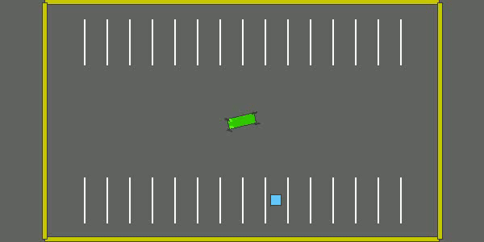

# Parking Environment
The Parking environment in the HighwayRLExplorer project simulates the complex task of parking a vehicle. In this challenging scenario, agents must learn to navigate tight spaces and park with precision. This environment serves as a testbed for various reinforcement learning strategies, each tailored to master the fine control required for successful parking.

  

## Model-Based Approach

The Model-Based Agent represents a strategic approach to the parking task. Unlike methods that rely solely on trial and error, the model-based approach equips the agent with a predictive model – a representation of the environment's dynamics. This model enables the agent to forecast the future outcomes of various actions without needing to execute them physically, allowing for sophisticated planning and decision-making.

### Planning with a Predictive Model

The core of the Model-Based Agent's approach lies in its ability to simulate future states of the environment. With this foresight, the agent can evaluate different action sequences to determine the most effective path to the parking spot. This kind of planning is akin to a human driver envisioning different parking maneuvers before turning the steering wheel.

### Advantages of the Model-Based Method

A significant advantage of using a model-based method is the potential for better sample efficiency. Since the agent can "think ahead" and evaluate the consequences of actions internally, it can learn effective behaviors with fewer interactions with the actual environment. This aspect is particularly valuable in scenarios where real-world interactions are costly or impractical to obtain in large quantities.

### Implementation in the Parking Environment

In our Parking environment, the Model-Based Agent leverages this predictive model to navigate complex parking scenarios. By iteratively updating its internal model through interactions with the environment, the agent refines its ability to predict and plan, resulting in more precise and reliable parking maneuvers.

### Results 

The GIF below illustrates the Model-Based Agent in action within the Parking environment. It showcases the agent's ability to execute complex parking maneuvers, demonstrating the practical application of its predictive model.

  

---

For an in-depth exploration of the model-based approach, including the mathematical formulations, algorithmic details, and implementation specifics from scratch, refer to the `Parking_Model_Based.ipynb` notebook within this repository.

## Deep Deterministic Policy Gradient (DDPG) Approach

The DDPG Agent takes on the parking challenge by leveraging the Deep Deterministic Policy Gradient method, a model-free, off-policy actor-critic algorithm optimized for continuous action spaces. Unlike the model-based approach, DDPG learns to directly map states to actions to maximize reward without constructing an explicit model of the environment.

### Continuous Control with Actor-Critic Method

At the heart of the DDPG Agent's strategy is the actor-critic architecture, which captures the best of both worlds: it utilizes two networks to separately approximate the policy (actor) and the value (critic) functions. This separation allows for more stable and robust policy updates, particularly well-suited to the precise maneuvers required in parking.

### Advantages of the DDPG Method

The DDPG algorithm stands out in its ability to handle high-dimensional, continuous action spaces with ease. This capability is crucial in the Parking environment, where the agent must output a smooth continuum of steering, acceleration, and braking actions. Moreover, DDPG incorporates experience replay and target networks to further stabilize the learning process.

### Implementation in the Parking Environment

In our Parking environment, the DDPG Agent demonstrates the application of its continuous control capabilities. The notebook delineates how the agent interacts with the environment, learns from its experiences, and refines its policy over time to achieve efficient and precise parking.

### Results

The following GIF captures the DDPG Agent as it masterfully navigates to the parking spot. As we can see, the agent doesn't perform very well.To try to improve accuracy, we implemented DDPG with HER (Hindsight Experience Replay) [https://arxiv.org/pdf/1707.01495.pdf]

  

---

The `Parking_DDPG.ipynb` notebook is furnished with the complete code and commentary, offering a transparent view of the DDPG agent's learning mechanics in action. For those interested in delving into the algorithmic intricacies or reproducing the training process, the notebook serves as a comprehensive resource.

## DDPG with Hindsight Experience Replay (HER) Approach

In the pursuit of an even more efficient learning process in the Parking environment, we extend the capabilities of the DDPG agent by integrating Hindsight Experience Replay (HER). This innovative technique allows the agent to learn from unsuccessful episodes by reinterpreting them as successful ones toward alternative goals.

### Learning from Alternatives with HER

HER is a strategy that reframes failures as successes by changing the perspective on the goal. Even if the agent does not reach the intended parking spot, each attempt is valuable. By treating the final state of an episode as a desired outcome, the agent can learn from what would traditionally be considered negative experiences.

### Advantages of DDPG with HER

This approach significantly enhances learning efficiency, particularly in environments where successes are sparse and precious. By utilizing every piece of experience, the DDPG with HER agent acquires a more robust policy that can generalize across a variety of scenarios, ultimately leading to higher success rates in the task of parking.

### Implementation in the Parking Environment

The `Parking_DDPG_HER.ipynb` notebook showcases the implementation of the DDPG with HER agent. It walks through the integration of HER into the learning process, detailing the changes and benefits it brings to the DDPG algorithm. The notebook provides a comprehensive view of the training process, from initialization to execution.

