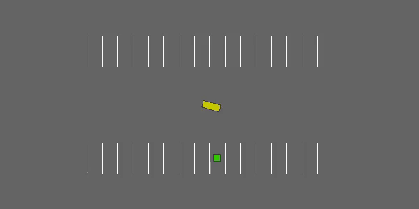
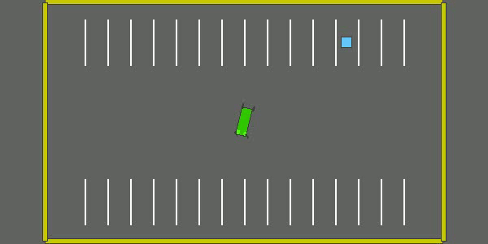

# Parking Environment
The Parking environment in the HighwayRLExplorer project simulates the complex task of parking a vehicle. In this challenging scenario, agents must learn to navigate tight spaces and park with precision. This environment serves as a testbed for various reinforcement learning strategies, each tailored to master the fine control required for successful parking.

  

## Model-Based Approach

The Model-Based Agent represents a strategic approach to the parking task. Unlike methods that rely solely on trial and error, the model-based approach equips the agent with a predictive model – a representation of the environment's dynamics. This model enables the agent to forecast the future outcomes of various actions without needing to execute them physically, allowing for sophisticated planning and decision-making.

### Planning with a Predictive Model

The core of the Model-Based Agent's approach lies in its ability to simulate future states of the environment. With this foresight, the agent can evaluate different action sequences to determine the most effective path to the parking spot. This kind of planning is akin to a human driver envisioning different parking maneuvers before turning the steering wheel.

### Advantages of the Model-Based Method

A significant advantage of using a model-based method is the potential for better sample efficiency. Since the agent can "think ahead" and evaluate the consequences of actions internally, it can learn effective behaviors with fewer interactions with the actual environment. This aspect is particularly valuable in scenarios where real-world interactions are costly or impractical to obtain in large quantities.

### Implementation in the Parking Environment

In our Parking environment, the Model-Based Agent leverages this predictive model to navigate complex parking scenarios. By iteratively updating its internal model through interactions with the environment, the agent refines its ability to predict and plan, resulting in more precise and reliable parking maneuvers.

### Results 

The GIF below illustrates the Model-Based Agent in action within the Parking environment. It showcases the agent's ability to execute complex parking maneuvers, demonstrating the practical application of its predictive model.

  

---

For an in-depth exploration of the model-based approach, including the mathematical formulations, algorithmic details, and implementation specifics from scratch, refer to the `Parking_Model_Based.ipynb` notebook within this repository.
