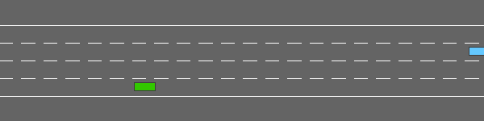

# HighwayRLExplorer

Welcome to HighwayRLExplorer, where the intricacies of vehicular control meet the cutting-edge realm of Reinforcement Learning (RL). This repository is devoted to the development of RL agents tailored for automotive environments, tackling the nuances of highway navigation, the precision of parking maneuvers, and the dynamics of roundabout negotiation.

## Environments

Within HighwayRLExplorer, you will find three key environments, each presenting its own unique set of challenges and learning opportunities for reinforcement learning agents:

### Highway
In the Highway environment, agents are tasked with the challenge of driving along a multi-lane roadway populated with other vehicles. The objective is to navigate at high speed while avoiding collisions and adhering to traffic rules.

### Roundabout
The Roundabout environment requires agents to approach and navigate through a busy roundabout with flowing traffic. Success is measured by the agent's ability to efficiently merge into and exit from the roundabout, managing both lane changes and speed while avoiding accidents.

### Parking
The Parking environment presents a goal-oriented control task where the agent must maneuver a vehicle into a parking space with precision. This tests the agent's ability to handle complex spatial constraints and fine motor control.

## License
This project is open-sourced under the GPL-3.0 license. For more details, see the [LICENSE](LICENSE) file in the repository.

Feel free to explore, contribute, and join us in advancing the state of automotive AI through reinforcement learning.
