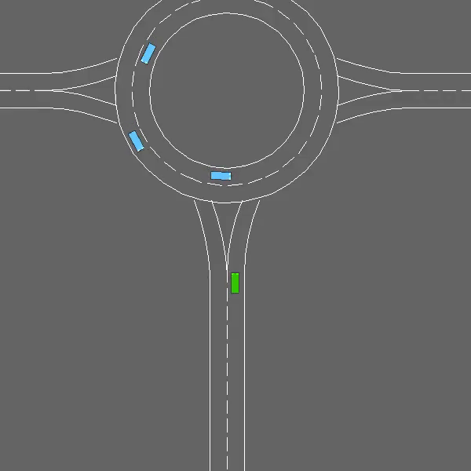
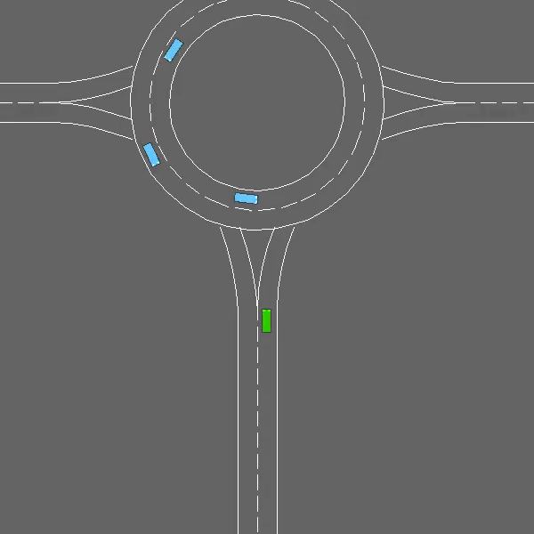

# Roundabout Environment

The Roundabout environment within the HighwayRLExplorer project provides a complex scenario where agents learn to navigate through roundabouts efficiently. This notebook includes the setup and implementation of a reinforcement learning agent, demonstrating the nuances of roundabout negotiation.

  

## Overview

This Jupyter notebook demonstrates the initialization of the Roundabout environment, the application of reinforcement learning algorithms, and the fine-tuning of hyperparameters. It aims to guide you through the process of training an agent capable of handling roundabouts with continuous traffic flow.

## Features

- **Environment Initialization**: Details on setting up the Roundabout simulation with necessary configurations and installations.

- **Reinforcement Learning Implementation**: An introduction to the Deep Q-Network (DQN) used to train the agent, outlining its architecture and learning mechanisms.

- **Video Recording**: Instructions on how to record the agent's performance within the environment, which can be valuable for visual evaluation and presentations.

- **Hyperparameters Fine-Tuning**: Insights into the process of tweaking hyperparameters to improve the agent's learning efficiency and performance.

## Explanation

In the development of the Roundabout agent, the [Stable-Baselines3 (sb3) library](https://github.com/DLR-RM/stable-baselines3/tree/master) was instrumental due to its well-established implementations of cutting-edge reinforcement learning algorithms. The core algorithm driving our agent's learning process is the Deep Q-Network (DQN). DQN is celebrated for its proficiency in navigating high-dimensional observation spaces and managing discrete action spaces. This quality is particularly beneficial in the Roundabout environment, where the agent is required to make precise and strategic decisions continuously. By employing sb3's implementation of DQN, our agent is powered by the most recent advancements and methodologies in reinforcement learning, setting a strong foundation for sophisticated experimentation and refinement of our models.

## Results

### Video 1

  

In this video, we see the agent in the environment with higher traffic density.

### Video 2

  

This video displays the agent with fewer cars, allowing for a clearer observation of its refined navigation tactics in the roundabout.

For a step-by-step guide on how to replicate our results or to contribute to the Roundabout environment's development, please refer to the detailed explanations and code comments within the notebook.
